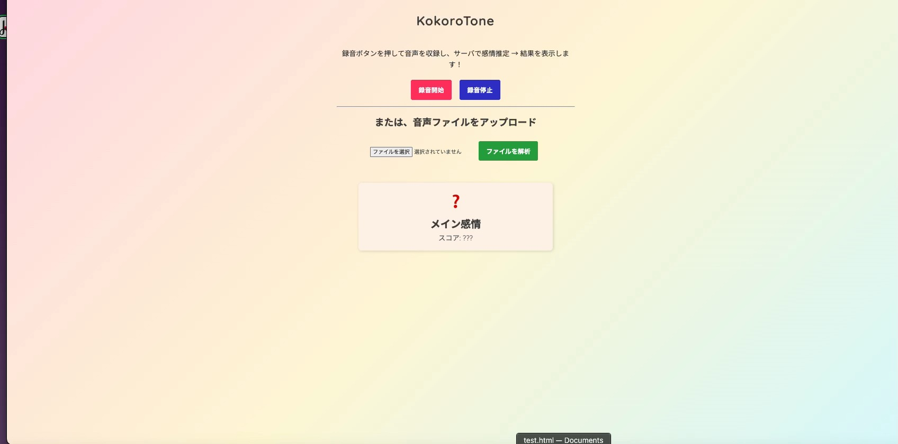

HTML5
CSS3
JavaScript
FastAPI (Python)

FunASR 
* アリババのDharma Instituteによって開発されたオープンソースの音声認識ツールキット。
* https://github.com/modelscope/FunASR
* ライセンス：MIT
* 
emotion2vec_plus_large
* 音声認識・感情分析モデル
* ライセンス：Apache License 2.0 
* https://modelscope.cn/models/iic/emotion2vec_plus_large/summary
* 日本語・多言語音声モデルを使用。
